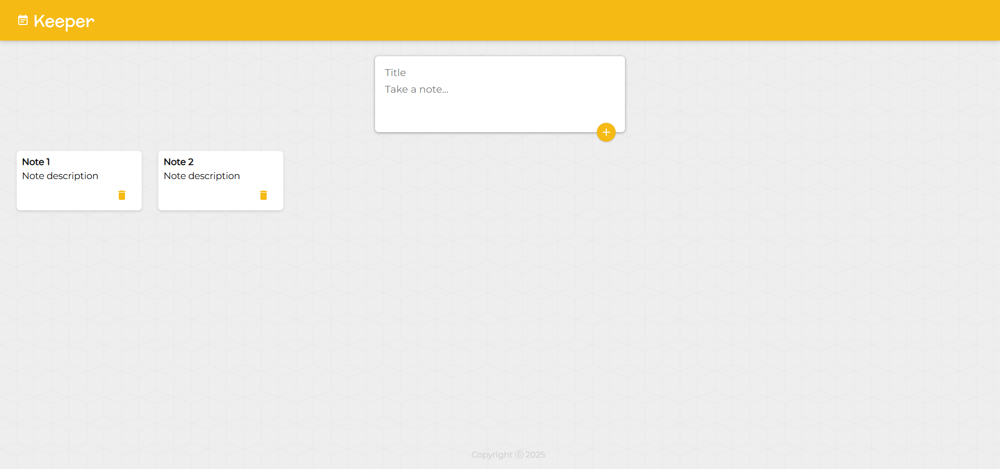

# 📝 The Keeper App

A simple and elegant note-taking application built with **React**. This app allows users to create, view, edit and delete notes with a clean user interface.

---

## ⚙️ Tech Stack

- [React](https://reactjs.org/)
- [Vite](https://vitejs.dev/)
- [JavaScript](https://developer.mozilla.org/en-US/docs/Web/JavaScript)
- [Material-ui](https://mui.com/)
- [Node.js](https://nodejs.org/en)
- [Express.js](https://expressjs.com/)
- [Zustand](https://zustand.docs.pmnd.rs/getting-started/introduction)
- [MongoDB](https://www.mongodb.com/)

---

## 🚀 Getting Started

### 1. Clone the repository
```bash
git clone https://github.com/joana-mendonca/the-keeper-app.git
cd the-keeper-app
```

### 2. Install Dependencies
```bash
npm install
```

### 3. Run the app locally
```bash
npm run dev
```

## 📸 Screenshots


## 📚 Credit
The frontend of this project was created as part of following **[The Complete Full-Stack Web Development Bootcamp](https://www.udemy.com/course/the-complete-web-development-bootcamp/)** on Udemy by Dr. Angela Yu.

Special thanks to Dr. Yu for her comprehensive and beginner-friendly teaching approach. This app was built based on concepts covered in the React.js module, with additional customization and enhancements for personal learning and practice.

## 🛠️ Features I added
- ⚛ Use zustand to manage statement
- 🗄️ Configured backend with express.js and conected to a no-sql database
- 🔥 Built an API
- 🐞 Error Handling
- 🌐 Deployment (TBD)